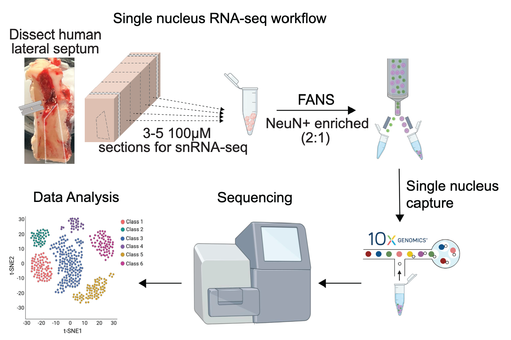

# ls_molecular-profiling
## Welcome to the ls_molecular-profiling project! 

# Project overview
This project includes snRNA-seq analysis of the human lateral septum (LS) from three separate donors. The two primary goals for this analysis are to 1) characterize transcriptional heterogeneity of the human LS, and 2) investigate cross-species conservation and divergence of marker genes. 

## Interactive Websites
We provide the following interactive website to explore the data:
* snRNA-seq: TO DO

## Citing our work

Please cite this [manuscript](https://doi.org/10.1101/TODO) if you use
data from this project.

> TODO

Below is the citation in [`BibTeX`](http://www.bibtex.org/) format.

    @article {TODO
    }

## Data Access

We highly value open data sharing and believe that doing so accelerates
science.

### Processed Data

TODO 

### Raw data

TODO

## Internal
JHPCE location: /dcs04/lieber/marmaypag/ls_molecular-profiling_LIBD1070/ls_molecular-profiling/
