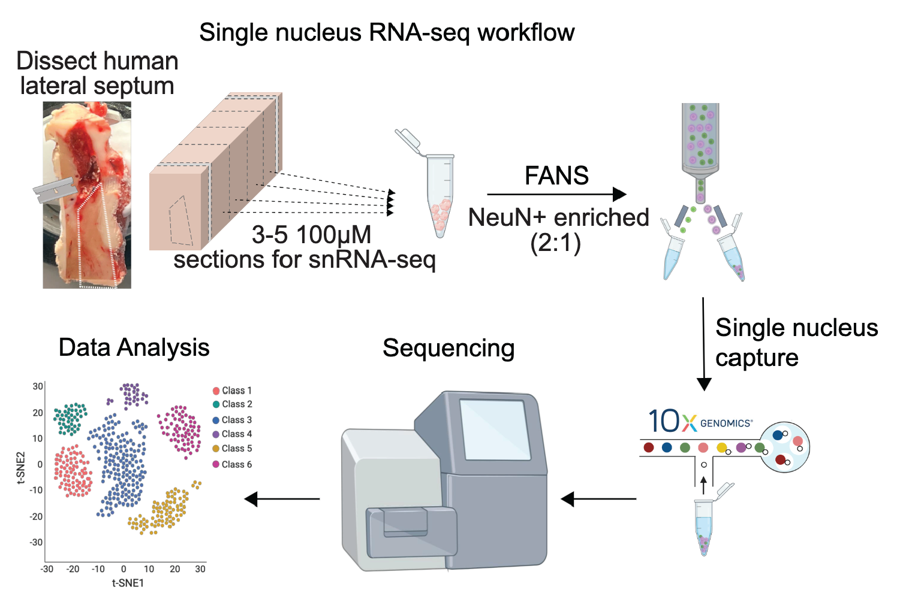

# ls_molecular-profiling
## Welcome to the ls_molecular-profiling project! 

# Project overview
This project includes snRNA-seq analysis of the human lateral septum (LS) from three separate donors. The two primary goals for this analysis are to 1) characterize transcriptional heterogeneity of the human LS, and 2) investigate cross-species conservation and divergence of marker genes. 

## Data Access

We highly value open data sharing and believe that doing so accelerates
science.

- [`sce object (jhpce#ls_molecular-profiling_sce)`](https://research.libd.org/globus/)
- [`SRA Submission`](https://www.ncbi.nlm.nih.gov/bioproject/PRJNA1093410)

## Interactive Websites
All of these interactive websites are powered by open source software,
namely:

- 👀 [`iSEE`](https://doi.org/10.12688%2Ff1000research.14966.1)

We provide the following interactive websites: 
- [Human LS snRNAseq](https://libd.shinyapps.io/LS_snRNAseq/)

## Citing our work

Please cite this [manuscript](https://www.biorxiv.org/content/10.1101/2024.04.22.590602v1) if you use
data from this project.

> Phillips RA 3rd, Oh S, Bach SV, Du Y, Miller RA, Kleinman JE, Hyde TM, Hicks SC, Page SC, Martinowich K. Transcriptomic characterization of human lateral septum neurons reveals conserved and divergent marker genes across species. bioRxiv [Preprint]. 2024 Apr 26:2024.04.22.590602. doi: 10.1101/2024.04.22.590602. PMID: 38712125; PMCID: PMC11071425.

Below is the citation in [`BibTeX`](http://www.bibtex.org/) format.

    @article{phillips2024transcriptomic,
      title={Transcriptomic characterization of human lateral septum neurons reveals conserved and divergent marker genes across species},
      author={Phillips III, Robert A and Oh, Seyun and Bach, Svitlana V and Du, Yufeng and Miller, Ryan A and Kleinman, Joel E and Hyde, Thomas M and Hicks, Stephanie C and Page, Stephanie C and Martinowich, Keri},
      journal={bioRxiv},
      year={2024},
      publisher={Cold Spring Harbor Laboratory Preprints}
      }

## Contact
We value public questions, as they allow other users to learn from the answers. If you have any questions, please ask them at LieberInstitute/ls_molecular-profiling/issues  and refrain from emailing us. Thank you again for your interest in our work!

## Internal
JHPCE location: /dcs04/lieber/marmaypag/ls_molecular-profiling_LIBD1070/ls_molecular-profiling/
